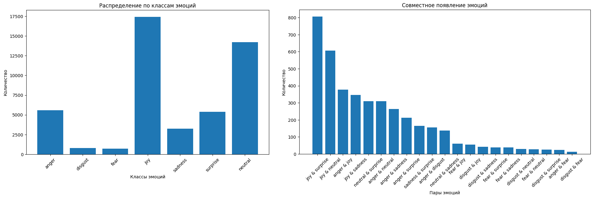
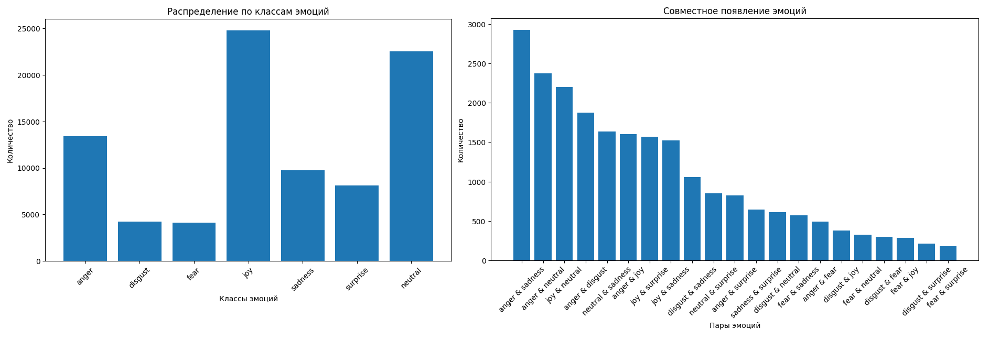
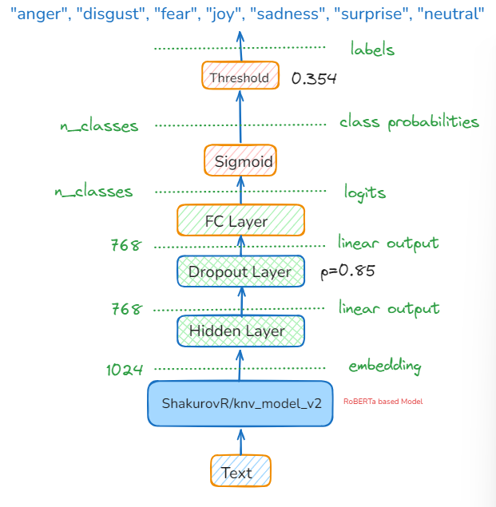

# Криптонит: Классификация эмоций в текстах
Задача для хакатона (проектного практикума) МФТИ ПУСК «Науки о данных», декабрь 2024.
### Задача:
Обучить языковую модель для классификации эмоций в текстах на русском языке. Количество эмоций - 7, при этом один текст может содержать не одну эмоцию, а несколько (multiclass multilabel classification).
## Содержание
1. [Состав команды и роли](#состав-команды-и-роли)
2. [Актуальное состояние проекта](#актуальное-состояние-проекта)
3. [Используемые методы](#используемые-методы)
    * [Предобработка данных](#предобработка-данных)
        - [Расширение датасета](#расширение-датасета)
        - [Аугментация данных](#аугментация-данных)
        - [Обработка эмодзи](#обработка-эмодзи)
        - [Обработка ошибок ASR](#обработка-ошибок-asr)
    * [Архитектура модели](#архитектура-модели)
    * [Гиперпараметры](#гиперпараметры)
4. [Запуск](#запуск)
5. [Основные функции и классы в коде](#основные-функции-и-классы-в-коде)
6. [Выводы](#выводы)
7. [Направления дальнейших исследований](#направления-дальнейших-исследований)

## Состав команды и роли
- Вяткин Роман: Капитан, Scrum master, Data Scientist
- Новиков Валентин: ML Инженер
- Назаров Михаил: ML Инженер
- Яськова Марина: ML Инженер
- Ихматуллаев Даврон: ML Инженер
- Заславская Вероника: Data Scientist, Data Engineer
- Косачев Дмитрий: MLOps

## Актуальное состояние проекта
Подготовлен ноутбук с решением задачи: [ссылка](./emotion_classification_datasorceres.ipynb).
* Ноутбук подготовлен на основе baseline-решения, предоставленного заказчиком.
* Наш лучший результат по метрике weighted f1-score на тестовой выборке — **0.64**. Метрика рассчитывается тестами [Kaggle-соревнования](https://www.kaggle.com/competitions/cryptonite-hack-sf/).
* По сравнению с baseline-решением мы улучшили результат на 0.1 (baseline-решение показало результат на тесте ~0.54). Это лучший результат в лидерборде Kaggle-соревнования.
* Также мы предлагаем [идеи для дальнейших исследований](#направления-дальнейших-исследований) по улучшению результата.

## Используемые методы
### Предобработка данных
#### Расширение датасета
Цель расширения — сгладить дисбаланс классов в тренировочном датасете и стимулировать повышение робастности обучаемой на этих данных модели.

Для расширения датасета использовали датасет https://huggingface.co/datasets/Djacon/ru-izard-emotions. Из него взяли примеры, содержание метки fear, disgust и sadness (24891 строк). Дополнительно в датасет было добавлено еще ~700 строк синтезированных при помощи LLM данных для классов fear и disgust.

* Размер тренировочной выборки, предоставленной заказчиком: 43410 строк.
* Размер тренировочной выборки после расширения датасета: 69973 строк.

Baseline-датасет:

Датасет после расширения:

#### Обработка эмодзи
Реализована при помощи библиотеки [emoji](https://pypi.org/project/emoji/).

Функция вида emoji.demojize("👍", language='ru') переводит иконки эмодзи в текстовое представление на русском языке.

### Архитектура модели
Подход, который мы выбрали для решения задачи — это fine-tuning предобученных моделей, размещенных в репозитории Huggingface.

* В рамках исследования мы протестировали ряд BERT-like архитектур моделей (BERT, RoBERTa, DistilBERT и др.), а также некоторые модели с архитектурами других типов.
* Текущий лучший результат показала модель с архитектурой RoBERTA.

Условная схема инференса модели приведена ниже на картинке:

### Гиперпараметры
Мы экспериментировали со значениями следующих гиперпараметров:
* Количество эпох
* Величина шага оптимизатора
* Сила регуляризации оптимизатора
* Тип оптимизатора
* Балансировка (weight) в лосс-функции
* Количество классификационных выходных слоев
* Тип активационных функций
* Тип нормализации
* Размер скрытого слоя
* Величина порога уверенности для фильтрации предсказаний
* С увеличением числа линейных слоев в «голове» модели мы меняем уровень Dropout, который их разделяет.

## Запуск
Код решения содержится в [ноутбуке](./emotion_classification_datasorceres.ipynb), представляющем собой модифицированное baseline-решение. Для воспроизведения результатов достаточно выполнить последовательный запуск всех ячеек.

Ноутбук содержит пути до файлов с данными, при запуске их потребуется заменить на актуальные.

Расширенный тренировочный датасет можно скачать [здесь](./data/train_plus_djacon.csv). Валидационную выборку мы оставили без изменений.

Дообученную нами модель можно загрузить по [ссылке](https://disk.yandex.ru/d/42y7GiGesJGhQw).

Для обучения мы использовали предобученную модель ShakurovR-knv_model_v2, которая была размещена на Huggingface, однако в середине хакатона была удалена автором. Сохраненную версию этой модели можно скачать [здесь](https://disk.yandex.ru/d/Hk0BKtcJin8UAQ).

## Основные функции и классы в коде
* seed_everything: функция для фиксации всех используемых в коде генераторов случайных величин. Обеспечивает воспроизводимость.
* get_alphabet: функция для выведения всех уникальных символов в наборе данных.
* plot_histogram: функция для построения гистограммы распределения классов (эмоций) в датасете
* plot_combined_emotions: функция для построения распределения попарной встречаемости эмоций в примерах датасета
* class Model: класс оборачивает предобученную модель и добавляет к ней классификационную "голову"
* class EmotionDataset: класс для подготовки датасета к обучению модели
* train: функция, содержащая цикл обучения модели
* validation: функция для получения предсказаний модели. Используется для валидации во время цикла обучения, а также для получения предсказаний на тестовой выборке

## Выводы
Нам удалось достичь метрики weighted F1-score на уровне 0.64. Улучшение достигнуто за счет комплексного подхода к обработке данных, выбора архитектуры модели и экспериментов с гиперпараметрами.
*	Увеличение тренировочной выборки с 43,410 строк до 69,973 строк (на 61%) помогло сгладить дисбаланс классов и повысить робастность модели.
*	Использование внешнего датасета с метками эмоций *fear*, *disgust*, *sadness* и синтезированных данных для классов fear и disgust позволило улучшить представление редких классов.
*	Проведённые эксперименты показывают, что балансировка весов классов в лосс-функции, настройка уровня Dropout и изменение количества классификационных слоёв существенно влияют на результат.
*	Лучшая производительность на данный момент достигнута с помощью модели на основе RoBERTa.

*	Аугментация данных, включая перевод текстов через английский язык и замену слов синонимами, добавила устойчивости к шуму в данных, например, к ASR-ошибкам.
*	Эффективная обработка эмодзи и исправление распространённых ASR-ошибок сделали тексты более структурированными и унифицированными.
## Направления дальнейших исследований

#### Аугментация данных
Для повышения устойчивости модели к "испорченным" ASR-данным мы дополнительно тестируем применение к данным аугментации:
* Перевод на английский язык и обратно на русский с помощью моделей семейcтва [Helsinki-NLP](https://huggingface.co/Helsinki-NLP)
* Замена части слов случайным синонимом из корпуса wordnet (NLTK).

#### Обработка ошибок ASR
Методом визуального анализа в данных были выявлены некоторые часто встречающие ошибки, генерируемые ASR-моделью. 
Они были собраны в словарь и соотнесены с корректным написанием слов, после чего в тексте была произведена замена.

Например: "ыетс" —> "это", "ужеж" —> "уже".
